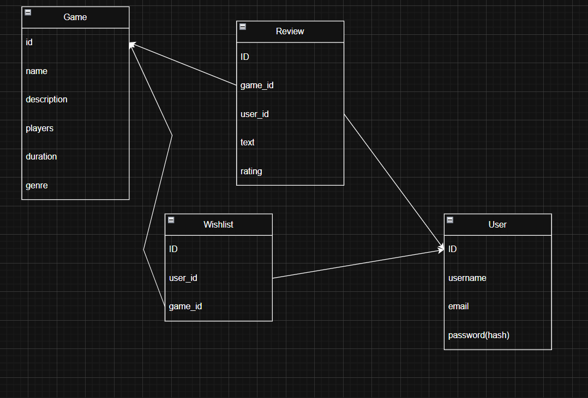

# Board Games Store

## Description

Board Games Store is a web platform where users can browse and buy board games. The website includes game listings, detailed pages for games, user reviews, and wishlists. Registered users can manage their profile and wishlist, and post reviews for games.

## REST API Endpoints

### Games

#### `GET /api/games`
Used to get the list of all board games.

- Method: GET  
- Response Status: 200 OK

#### `GET /api/games/{id}`
Used to get detailed information about a specific game.

- Method: GET  
- Response Status: 200 OK

---

### Reviews

#### `GET /api/games/{id}/reviews`
Used to get all reviews for a specific game.

- Method: GET  
- Response Status: 200 OK

#### `POST /api/games/{id}/reviews`
Used to add a review for a game (authenticated users only).

- Method: POST  
- Response Status: 201 Created

---

### Wishlist

#### `GET /api/wishlist`
Used to get the current user's wishlist (authenticated users only).

- Method: GET  
- Response Status: 200 OK

#### `POST /api/wishlist`
Used to add a game to the wishlist (authenticated users only).

- Method: POST  
- Response Status: 200 OK

#### `DELETE /api/wishlist/{game_id}`
Used to remove a game from the wishlist (authenticated users only).

- Method: DELETE  
- Response Status: 204 No Content

---

### Users & Authentication

#### `POST /api/register`
Used to register a new user.

- Method: POST  
- Response Status: 201 Created

#### `POST /api/login`
Used to log in a user.

- Method: POST  
- Response Status: 200 OK

#### `GET /api/profile`
Used to get the current user's profile.

- Method: GET  
- Response Status: 200 OK

#### `PUT /api/profile`
Used to update the current user's profile info.

- Method: PUT  
- Response Status: 200 OK

---

##  Database Schema

